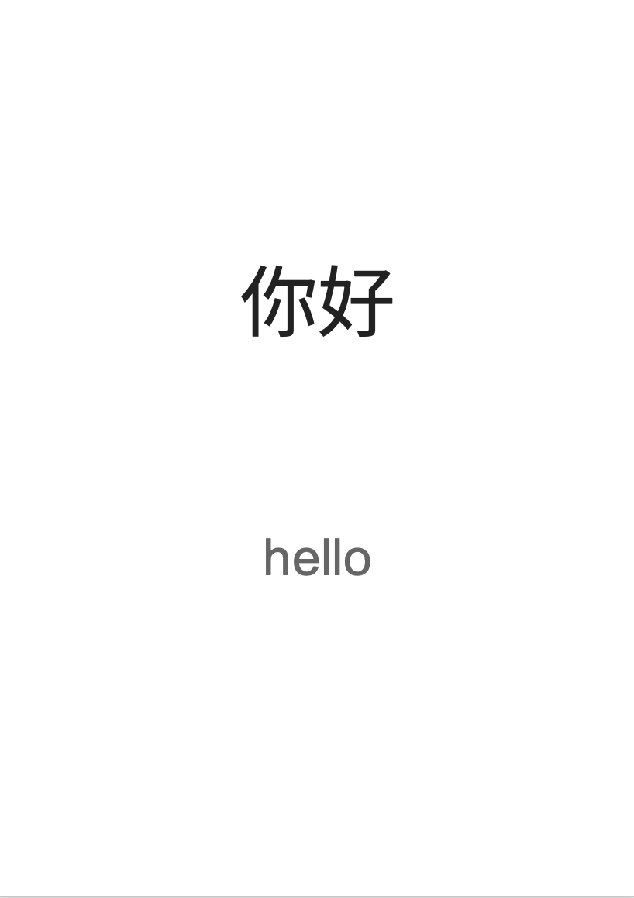
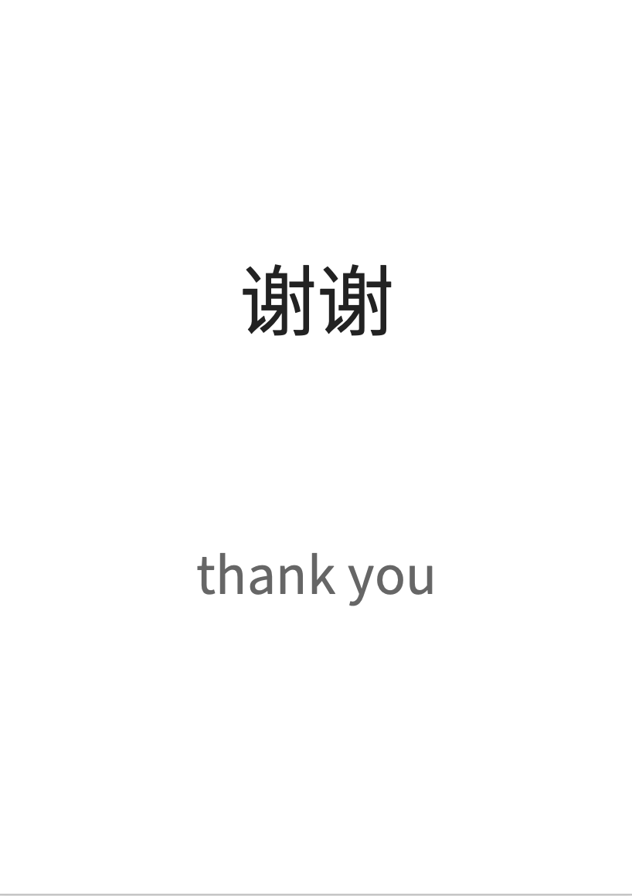
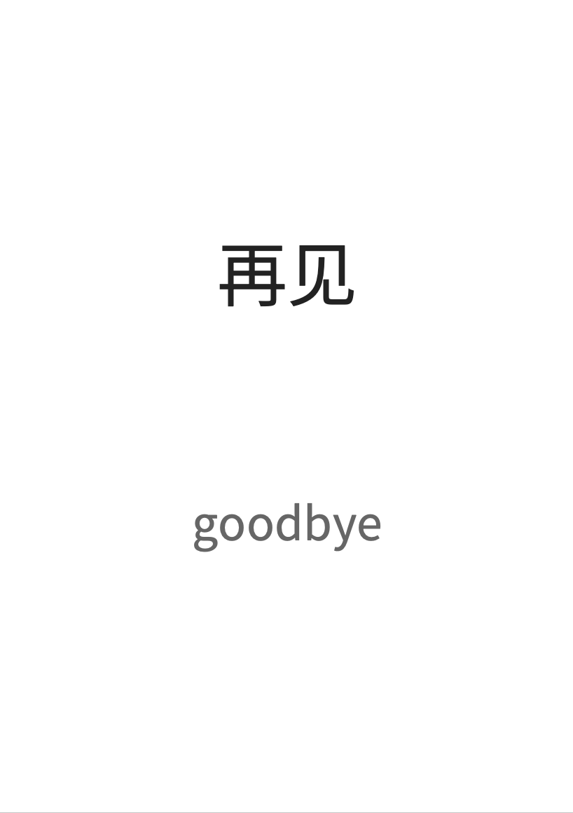

# Greetings – Chinese Learning Images

This folder contains Chinese learning images related to **basic greetings**.

Each image is designed for:

- Chinese language learners
- App testing
- OCR research datasets

The images use a clean design with:

- White background
- Large Chinese characters
- English translation

This makes them suitable for both **learning** and **text recognition testing**.

## Example Greeting Cards

## Naming Format

Images follow this naming pattern:

word_nihao_hello.png
word_xiexie_thankyou.png
word_zaijian_goodbye.png

## Purpose

These images can be used for:

- Chinese learning resources
- Testing OCR recognition

